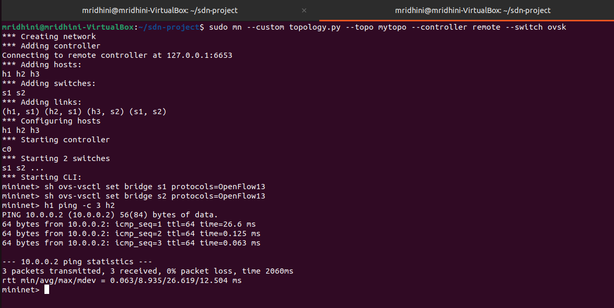
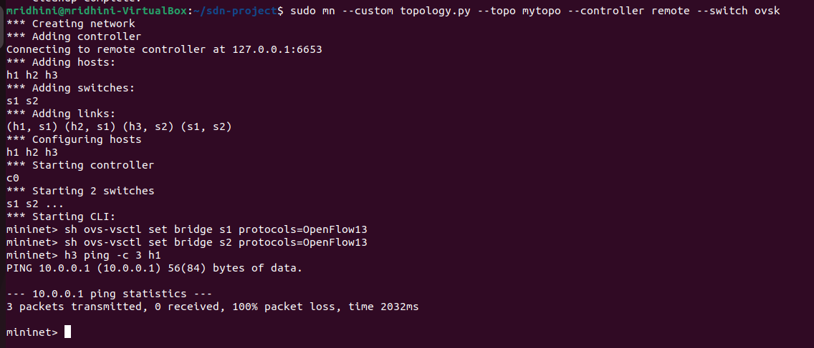
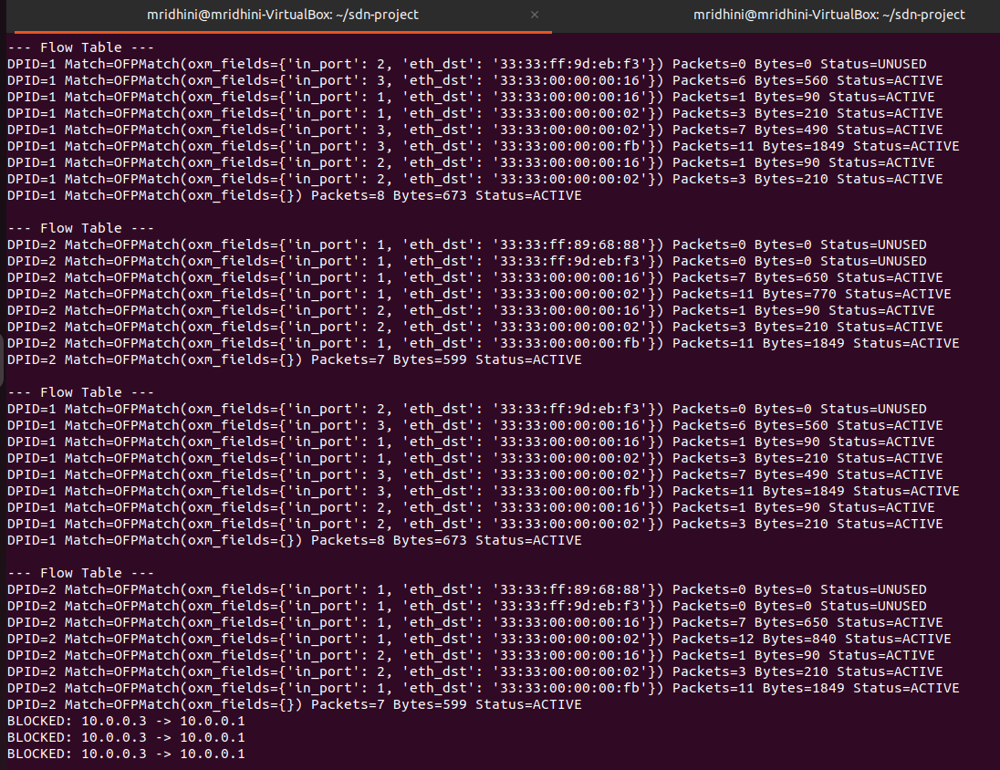
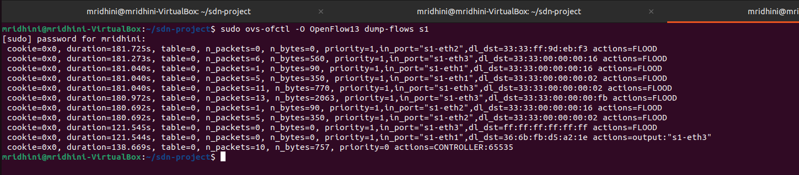

# Multi-Switch Flow Table Analyzer

## Problem Statement

This project implements a Software Defined Networking (SDN) based flow table analyzer using Mininet and a Ryu controller. The goal is to analyze flow entries in multiple switches, identify rule usage, and enforce traffic control policies dynamically.

---

## Objective

* Analyze flow tables in OpenFlow switches
* Identify active vs unused flow rules
* Dynamically install and monitor flow entries
* Implement controller-based traffic blocking
* Demonstrate centralized control using SDN

---

## Tools and Technologies

* Mininet (network emulation)
* Ryu Controller (SDN controller framework)
* Open vSwitch (software switch)
* Python

---

## System Architecture

The system consists of a Ryu controller connected to multiple Open vSwitch instances in a Mininet topology.

* Switches forward unknown packets to the controller using **Packet-In** messages
* The controller processes packets and installs flow rules
* Flow statistics are periodically collected from switches
* The controller enforces traffic policies centrally

---

## Topology

* 2 switches (s1, s2)
* 3 hosts (h1, h2, h3)
* Multi-switch SDN network

---

## Working Principle

* When a packet arrives at a switch, it is sent to the controller if no matching rule exists
* The controller learns MAC-to-port mappings and installs flow rules
* Flow statistics (packet count, byte count) are retrieved periodically
* Rules with increasing packet counts are classified as **active**
* Rules with zero packet counts are classified as **unused**
* Traffic from host **h3 is blocked** using controller logic

---

## Execution Steps

### 1. Start Controller

```
source ~/ryu-env/bin/activate
cd ~/sdn-project
ryu-manager controller.py
```

### 2. Start Mininet

```
sudo mn --custom topology.py --topo mytopo --controller remote --switch ovsk
```

### 3. Set OpenFlow Version

```
sh ovs-vsctl set bridge s1 protocols=OpenFlow13
sh ovs-vsctl set bridge s2 protocols=OpenFlow13
```

---

## Test Cases

### Allowed Traffic

```
h1 ping -c 3 h2
```

Expected Output:

* Successful communication
* 0% packet loss

---

### Blocked Traffic

```
h3 ping -c 3 h1
```

Expected Output:

* No communication
* 100% packet loss

---

## Flow Table Analysis

Flow entries are analyzed using:

```
sudo ovs-ofctl -O OpenFlow13 dump-flows s1
```

* Active rules → packet count increases
* Unused rules → packet count remains zero

---

## Proof of Execution

### Ping Results (Allowed Traffic)

Shows successful communication between h1 and h2 (0% packet loss).


---

### Blocked Traffic

Shows failed communication from h3 to h1 (100% packet loss).


---

### Controller Logs

Displays detection of blocked traffic by the controller.


---

### Flow Table Output

Shows installed flow rules with packet counts indicating usage.


---

## Conclusion

This project demonstrates how SDN enables centralized control of network behavior. The controller dynamically installs flow rules, monitors their usage, and enforces traffic policies. The system successfully differentiates between active and unused rules and blocks unauthorized traffic.

---

