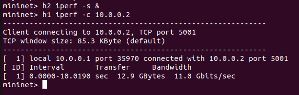

# Multi-Switch Flow Table Analyzer

## Problem Statement

This project implements a Software Defined Networking (SDN) based flow table analyzer using Mininet and a Ryu controller. The goal is to analyze flow entries across multiple switches, identify rule usage, and enforce traffic control policies dynamically.

---

## Objective

* Analyze flow tables in OpenFlow switches
* Identify active vs unused flow rules
* Dynamically install and monitor flow entries
* Implement controller-based traffic blocking
* Demonstrate centralized control using SDN

---

## Tools and Technologies

* Mininet (network emulation)
* Ryu Controller (SDN controller framework)
* Open vSwitch (software switch)
* Python

---

## System Architecture

The system consists of a centralized Ryu controller connected to multiple Open vSwitch instances in a Mininet topology.

* Switches forward unknown packets to the controller using **Packet-In** messages
* The controller processes packets and installs flow rules
* Flow statistics are periodically collected
* Policies such as blocking are enforced centrally

---

## Topology

* 2 switches (s1, s2)
* 3 hosts (h1, h2, h3)
* Multi-switch SDN network

---

## Design Justification

A multi-switch topology is used to demonstrate scalability of SDN control across multiple devices. Using two switches allows observation of flow rule behavior across different datapaths. The Ryu controller enables centralized decision-making and dynamic rule enforcement.

---

## Working Principle

* When a packet arrives, the switch sends it to the controller if no rule exists
* The controller learns MAC-to-port mappings
* Flow rules are installed dynamically based on traffic
* Packet counts are monitored to analyze rule usage
* Rules with increasing packet counts are **active**
* Rules with zero packet counts are **unused**
* Traffic from host **h3 is blocked** using controller logic

---

## Flow Rule Design

* Match fields include input port and destination MAC
* Actions specify output ports for forwarding
* Priority ensures forwarding rules override default rules
* Blocking is implemented using IP-based filtering in the controller

---

## Execution Steps

### 1. Start Controller

```id="axu3o2"
source ~/ryu-env/bin/activate
cd ~/sdn-project
ryu-manager controller.py
```

### 2. Start Mininet

```id="r3t2eq"
sudo mn --custom topology.py --topo mytopo --controller remote --switch ovsk
```

### 3. Set OpenFlow Version

```id="6qjv3y"
sh ovs-vsctl set bridge s1 protocols=OpenFlow13
sh ovs-vsctl set bridge s2 protocols=OpenFlow13
```

---

## Test Cases

### Allowed Traffic

```id="h8c0xp"
h1 ping -c 3 h2
```

Expected Output:

* Successful communication
* 0% packet loss

---

### Blocked Traffic

```id="a5zy2g"
h3 ping -c 3 h1
```

Expected Output:

* No communication
* 100% packet loss

---

## Flow Table Analysis

```id="9wphz7"
sudo ovs-ofctl -O OpenFlow13 dump-flows s1
```

* Active rules → packet count increases
* Unused rules → packet count remains zero

---

## Performance Analysis

* Latency is measured using ping
* Throughput is measured using iperf
* Allowed traffic shows normal latency and throughput
* Blocked traffic results in 100% packet loss
* Flow statistics confirm dynamic rule installation
* Packet counts differentiate active and unused rules

---

## Proof of Execution

### Allowed Traffic (Ping)

Shows successful communication between h1 and h2 (0% packet loss).


---

### Blocked Traffic

Shows failed communication from h3 to h1 (100% packet loss).


---

### Controller Logs

Displays blocked traffic detection by the controller.


---

### Flow Table Output

Shows installed flow rules and packet counts.


---

### Throughput (iperf)

Shows bandwidth between hosts.


---

## Validation

* Verified forwarding using h1 to h2 communication
* Verified blocking using h3 to h1 communication
* Verified flow entries using ovs-ofctl
* Verified controller logs for blocked traffic
* Verified throughput using iperf

---

## Conclusion

This project demonstrates how SDN enables centralized control of network behavior. The controller dynamically installs flow rules, monitors their usage, and enforces traffic policies. The system successfully identifies active and unused rules and blocks unauthorized traffic.

---

## Key Observations

* Flow rules are installed dynamically based on traffic
* Packet counts indicate rule activity
* Blocking is enforced centrally by the controller
* Multi-switch topology demonstrates scalability

---


